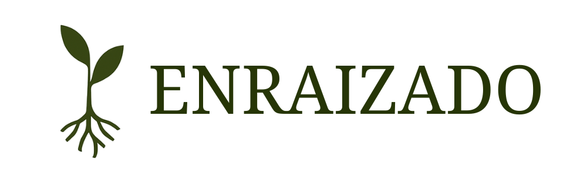

<p align="center">
  
</p>

# Enraizado – Sitio web corporativo 🌿

**Enraizado** es una empresa de acompañamiento estratégico para negocios, fundada por un equipo de mujeres profesionales en diseño digital, contabilidad e ingeniería comercial.

Nos dedicamos a brindar soluciones integrales que combinan visión, estructura y calidez, para acompañar a personas y equipos en la construcción de negocios más humanos, sostenibles y conscientes.

Este proyecto es nuestra casa digital: un sitio web diseñado para comunicar quiénes somos, qué ofrecemos y desde dónde trabajamos.

---

## 🧰 Built with

- [Vite](https://vitejs.dev/)
- [React](https://react.dev/)
- [Tailwind CSS](https://tailwindcss.com/) (próximamente)

---

## 🎯 Objetivo

Crear una presencia digital sólida, estratégica y cálida para Enraizado, que represente nuestros valores, servicios y esencia, desde una experiencia visual clara y moderna.

---

## 🚧 Estado del proyecto

En desarrollo.  
Por ahora cuenta con una estructura base en React + Vite, un diseño en evolución y el compromiso de convertirse en un sitio bello y funcional.

Próximas etapas:
- Integración de Tailwind CSS
- Construcción de componentes reutilizables
- Animaciones suaves y accesibilidad

---

## ⚙️ Instalación y ejecución local

Si quieres clonar este proyecto y probarlo localmente, sigue estos pasos:

**Paso 1:** Clona el repositorio

```bash
git clone https://github.com/tu-usuario/enraizado.git
```

**Paso 2:** Accede a la carpeta del proyecto

```bash
cd enraizado
```

**Paso 3:** Instala las dependencias necesarias:

```bash
npm install
```

**Paso 4:** Inicia el servidor de desarrollo:

```bash
npm run dev
```

**Paso 5:** Abre tu navegador y ve a <http://localhost:5173> para ver el sitio.

¡Y ya lo tienes! 🥳

<h3 align="center">✨ Desarrollado por Laura Barahona</h3>

<p align="center">
  Frontend Developer · React & Tailwind · UX/UI · Psicología aplicada al diseño<br>
  Combino tecnología, diseño y psicología para crear experiencias claras, cálidas y efectivas.
</p>

<p align="center">
  🌐 <a href="https://www.laurabarahona.cl">laurabarahona.cl</a> · 
  <a href="https://www.linkedin.com/in/laubarahona">🔗 LinkedIn</a> · 
  <a href="mailto:laurabarahona8@gmail.com">📫 Contacto</a>
</p>